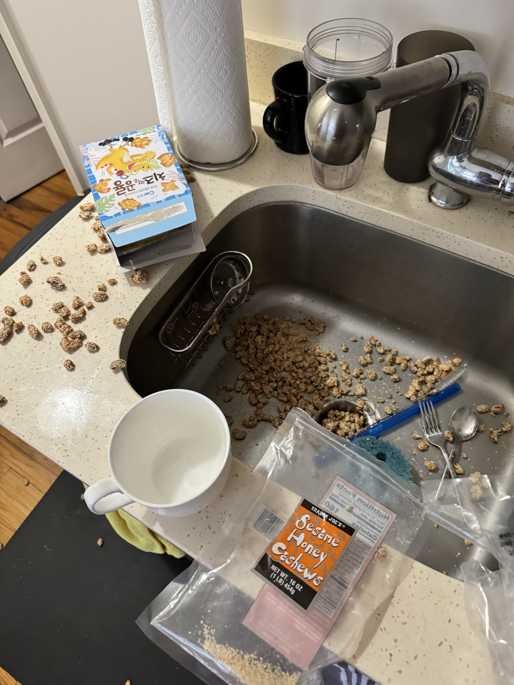

Justin is a software wanderer, split keyboarder, and floor sleeper. He currently works as a site reliability engineer at Atlassian. In his spare time, he enjoys reading books, touching grass, and wearing all black clothes.

**Links:**
~
[Linkedin](https://www.linkedin.com/in/justinliang1020/)
[Twitter](https://twitter.com/justinliang1020)
[Are.na](https://www.are.na/justin-liang/channels)
[Spotify](https://open.spotify.com/user/12149388936)
[Github](https://github.com/justinliang1020)
[Goodreads](https://www.goodreads.com/user/show/170472734-justin)
~

---

**websites i'm reading...**

 

---

|  |
| :------------------------------: |
|      _i spilled my cashews_      |
