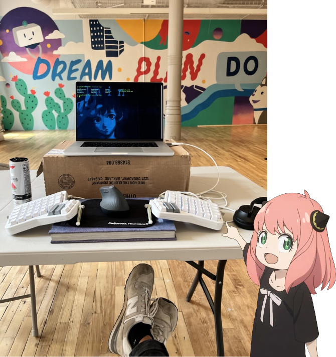
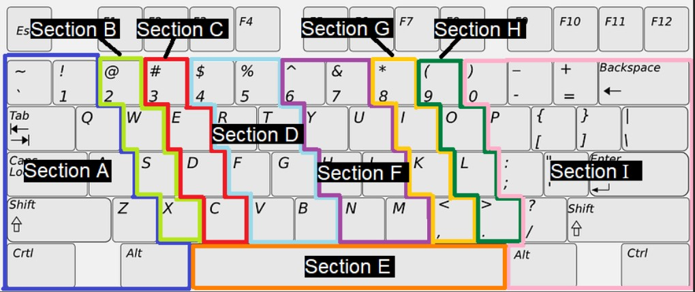
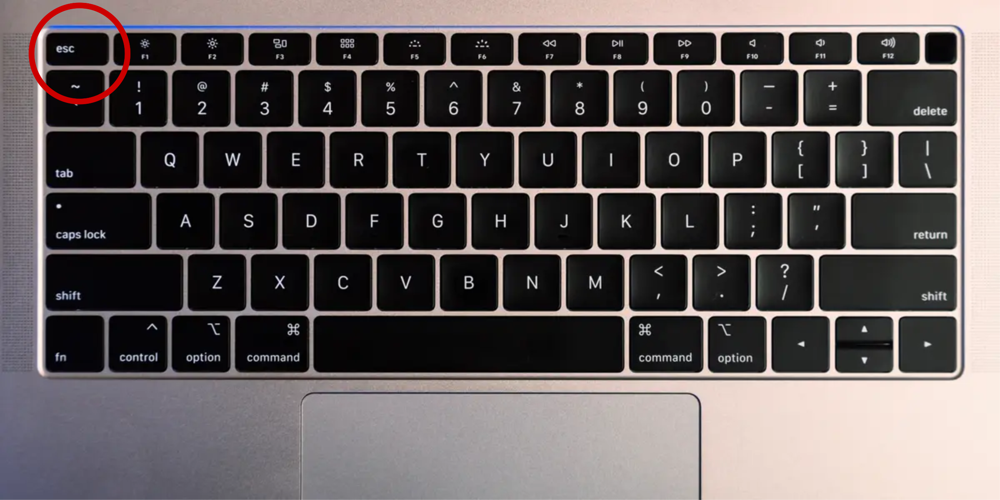
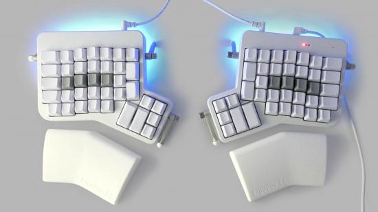
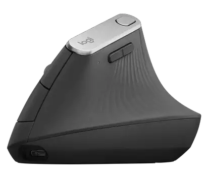
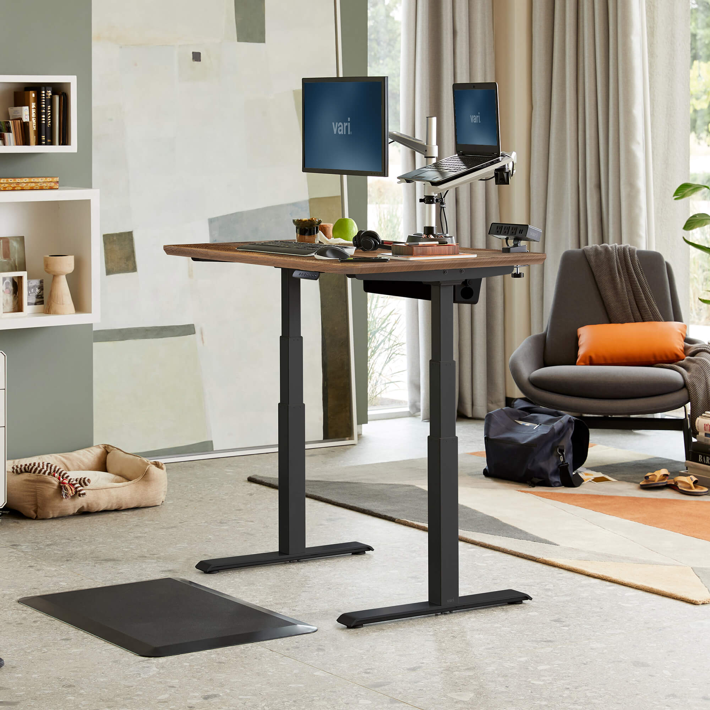
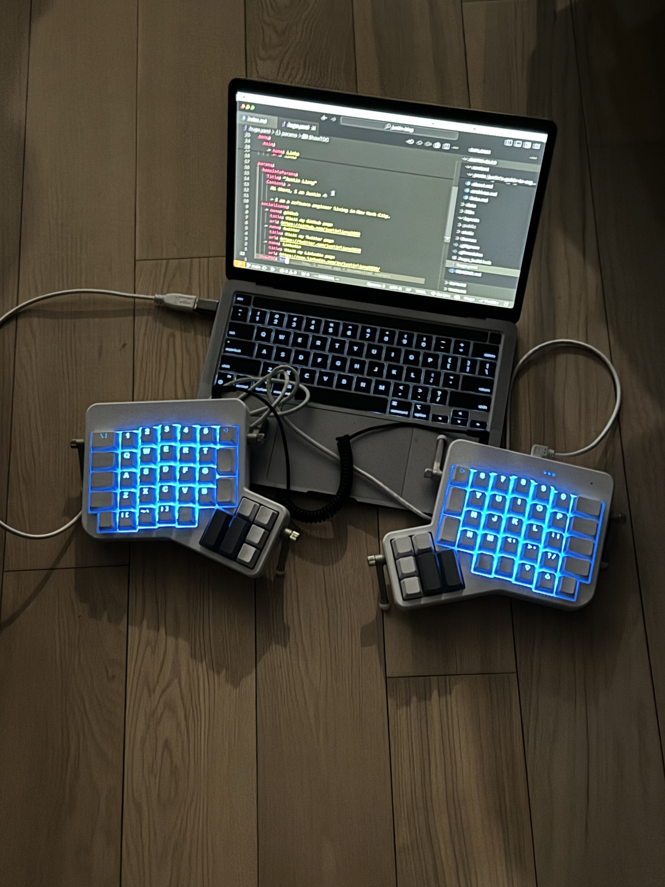
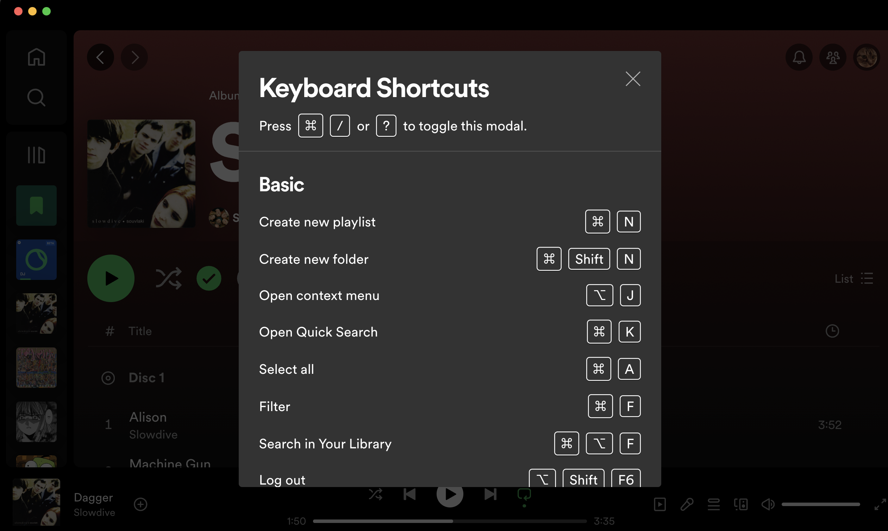
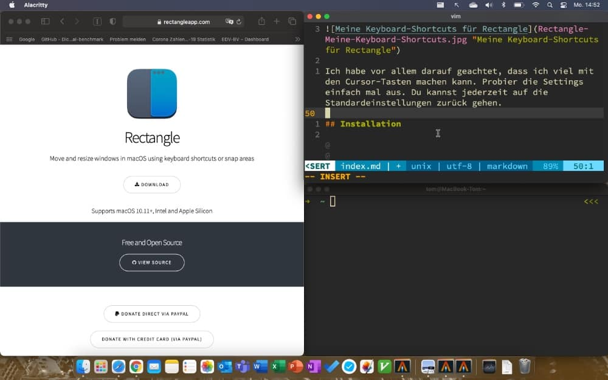

> Computers are fundamentally depressing because our body does not expect in its natural state to be motionless
>
> [Jonathan Blow](https://youtu.be/i7kh8pNRWOo?si=uXOIwhr-dAjdFkZ5&t=236)

In February 2023, I lost the ability to type.

Due to a severe case of RSI (repetitive strain injury), I was unable to type or use a mouse for many months. During this time, I fell into the rabbit hole of computer ergonomics in an attempt to regain the functionality in my hands. After much trial and error, I've managed to regain the use of my keyboard and can work in a full-time software engineering job today.

This is a guide I wish I had when I was recovering to explain the basics of proper computer ergonomics. Because of working on my own personal ergonomics setup, I feel **healthier, faster, and more in tune** with my computer.

## Using Hardware Ergonomically (your keyboard)

The keyboard is the foundational hardware we use to interact with computers. While the mouse is important, the most information-relevant actions (inputting text) are done through typing.

These are some general tips on how to use computer hardware more ergonomically (focusing on the keyboard).

### Level 1: Learn Touch Typing

Touch typing is the foundation of using your keyboard ergonomically and quickly.

While it's sometimes associated with being able to type without looking at your keyboard, that's only half of the true definition. The other half of touch typing involves placing your fingers on the **home row** of your keyboard as their base position and using that as a jumping-off point to reach the other keys.

The home row is (from left to right):

* left hand: `asdf`
* right hand: `jkl;`

*The Home Row*

*Touch Typing Keys*

Reference: [Touch Typing](https://opentextbc.ca/computerstudies/chapter/the-base-position/)

If you take away nothing else from this guide, learning to touch type is a great start.

### Level 2: Modify Keybindings

The simplest and quickest way of modifying your existing keyboard for your personal needs is to make sure the keys you are pressing are in comfortable places.

Take for example the `escape` key. On standard keyboards, this key is placed in the top left corner, a very uncomfortable position to reach. Go ahead and try to press it on your keyboard (if applicable) while staying in the **home row**; pretty much impossible, right?

The solution to fixing this is to move the `escape` key to a more comfortable position. For example, it can be rebound to the `caps lock` key, a much more reachable key to press while also replacing a key with not much functionality (why press `caps lock` when you can hold `shift`?).

This principle can be applied to pretty much every key, depending on the programmability of your keyboard.

Reference: [How to remap a keyboard on a Mac](https://www.theverge.com/23591533/mac-remap-keyboard-how-to)

### Level 3: Build an Ergonomic Setup

Buying the correct ergonomic setup is a highly personal process. Because of that, I will only briefly go over some general pointers so you can begin researching your ergonomic setup.

#### Ergonomic Keyboard

*The [Ergodox-EZ](https://ergodox-ez.com/) (my choice of ergonomic keyboard)*

* Split keyboards can help open your shoulders and allow for better overall arm flexibility
* Tenting (angling the split keyboard) promotes healthier wrist pronation
* Lower actuation force switches make it easier to type
* Programmable keybindings and layering reduce the need to awkwardly stretch for far keys
* Thumb clusters allow you to make better use of your strongest finger (rather than just devoting it to a space bar)
* Columnar keyboard layouts promote proper touch typing

#### Ergonomic Mouse

*[Logitech MX Vertical mouse](https://www.logitech.com/en-us/products/mice/mx-vertical-ergonomic-mouse.910-005447.html)*

* A Vertical mouse is a good alternative to the basic mouse since it promotes healthier wrist pronation
* Reduce your mouse sensitivity if you need to reduce awkward forearm movement, increase your mouse sensitivity if you need to reduce awkward wrist movement
* Touchpads are good for reducing awkward forearm movements when
* Track balls are also popular in the ergonomic space (I haven't personally tried them)

#### Desk/Chair

*Generic standing desk stock photo*

* Using a standing desk can improve shoulder pain due to better posture
* Remember that no posture is the best posture. The human body didn't evolve for sitting still for long periods so remember to stretch regularly and change your sitting position if needed
* A common problem is craning your head up or down to look at the screen. If this is happening, adjust the height of your laptop/monitor by adding objects like textbooks to make the top of your screen align to about eye level.

*Remember! No posture is the best posture. Sometimes it's nice to be on the floor*

## Using Software Ergonomically

I find that maximizing keyboard use is important for computer ergonomics since it promotes speed (less shifting between mouse and keyboard) and comfort. This is highly dependent on your personal use case though, i.e. some applications are unusable without a mouse.

### Level 1: Learn Keyboard Shortcuts (for everything!)

Invest time in learning the keyboard shortcuts of whatever software you use. It could be as simple as using `cmd+space` to open spotlight search (on MacOS) to learning the Spotify desktop app's keyboard shortcuts. Whatever it is, it will help you move faster on your computer, letting you spend less time on it.

### Level 2: Use Window Management Software

Window management software is important to keep your windows in a predictable place and managed via keyboard rather than manually dragging them. I would recommend [Rectangle](https://rectangleapp.com/) for MacOS since it's free OSS that does the job well.

### Level 3: Learn Vimium



Your web browser is most likely your most used computer software, but it isn't natively built to support keyboard-only navigation. A solution to this is to use [Vimium](https://vimium.github.io/), a way to navigate your browser using your keyboard inspired by the text editor Vim.

Although it can seem daunting at first to learn, the core of Vimium is in these 5 keys:

* `f`: click on links/buttons on a webpage
* `k`: scroll up
* `j`: scroll down
* `H` (capital H): go backward one page
* `L` (capital L): go forward one page

In combination with these default browser keybindings, you can eliminate 95% of your mouse usage. (Note these are on Google Chrome MacOS)

* `ctrl+tab`: jump to the next open tab
* `ctrl+shift+tab`: jump to the previous open tab
* `cmd+tab`: create a new tab

[Install Vimium on Chrome here](https://chromewebstore.google.com/detail/vimium/dbepggeogbaibhgnhhndojpepiihcmeb)

## Conclusion

Your computer is a tool that should be continuously molded to fit your personal needs; from choosing the right keyboard for your specific hands to experimenting with different keyboard shortcuts for your workflows.

Note that there is a lot that I haven't covered about computer ergonomics specifically for programmers since this guide is geared toward the general user.

Feel free to contact me (on [Twitter](https://twitter.com/justinliang1020)) if you have any questions or even just a cool keyboard shortcut to share!

## Related Links

video on shoulder pain: <https://www.youtube.com/watch?v=OSTqlujE9sw>
good computer ergonomics YouTuber: <https://www.youtube.com/@BenVallack>
