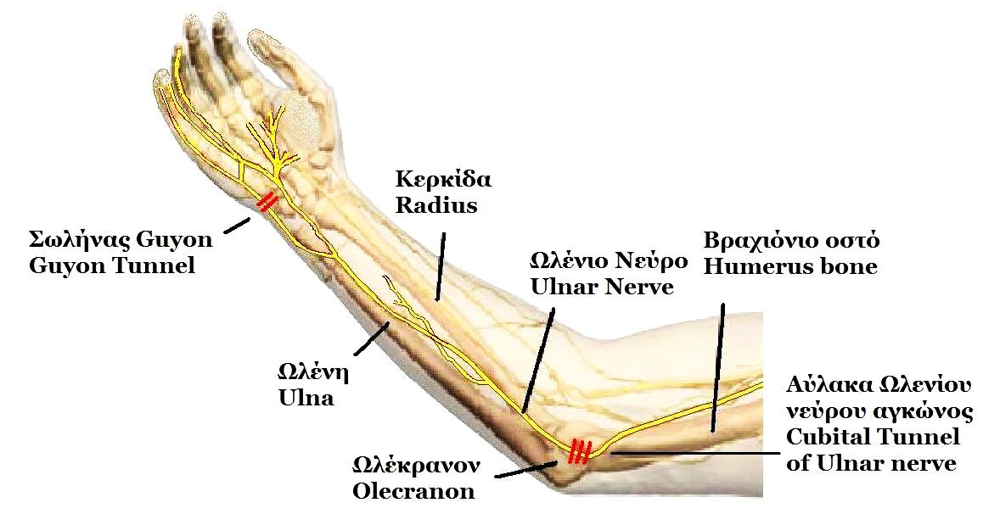
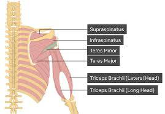
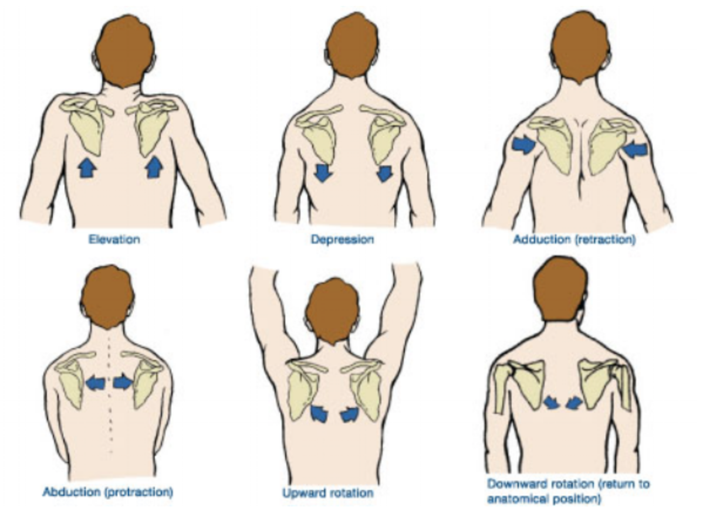

+++
title = 'Notes on personal nerve pain'
date = 2024-04-21
+++

## NOTE

these are just notes for myself that i post publically. don't take this as real medical advice, i'm just experimenting to attempt to heal my chronic pain.

## symptoms

* nerve pain
  * where:
    * ring and pinky finger
    * shoulder (delt area)
    * forearm
    * wrist
  * when:
    * primarily when sitting down and typing
  * feeling:
    * shooting
    * 3/10
    * not unberable, can still type but is very annoying

## what might help

(still unsure what helps for certain, should probably see doctor...)

### while sitting at computer

* tilting head up (higher monitor position)
  * tilt to about where jawbone is about parallel to floor
* tenting keyboard seems to help
* straight posture
* arms straight (reduce elbow bend, this makes sense if cubital tunnel syndrome results from bending of the elbow)

### stretches

* "fist stretch"
  * gripping fist very hard
  * curling fist inwards towards inner forearm
  * putting hand behind back
  * optionally carry a weight in that hand
* "pull up pants stretch"
  * <https://www.youtube.com/watch?v=9t77j3-vw48&t=146s>

## physical therapy

I will attempt some exercises and update later on their efficacy

* heavy farmers carries: <https://www.youtube.com/watch?v=9t77j3-vw48&t=146s>
* 6 inch punch: <https://www.youtube.com/watch?v=nqrhfMv-7oI>
* golfers elbow exercises: <https://www.youtube.com/watch?v=kIYDcsOpnyE>

<https://nielasher.com/blogs/video-blog/trigger-point-therapy-teres-minor>

possibly weak trapezius muscles cauinsg bad rotation of scapula

<https://www.youtube.com/watch?v=dCI-Qa6Fu-Y>

to promote upwards rotation of the scapula as to not crush the brachial plexus, i will work on strengthening the following muscles

* serratus anterior: scapular push ups <https://www.youtube.com/shorts/Ng-iiDUd_fs>
* upper trapezius: banded shoulder shrugs <https://youtu.be/dCI-Qa6Fu-Y?si=rjmiwUx08EXrkb8Y&t=105>
* lower trapezius: <https://www.youtube.com/watch?v=_81ZePwztIA>

to watch: <https://www.youtube.com/watch?v=iAPcPM0PQhk>
to read: <https://www.armoredheat.com/armored-heat-blog/scapular-upward-rotation>
