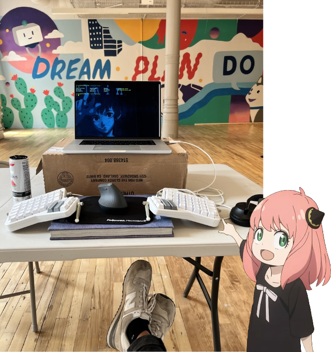

+++
title = "Justin's Guide to Computer Ergonomics"
date = 2024-03-24
+++

> Computers are fundamentally depressing because our body does not expect in its natural state to be motionless
>
> [Jonathan Blow](https://youtu.be/i7kh8pNRWOo?si=uXOIwhr-dAjdFkZ5&t=236)

In February 2023, I lost my ability to type.

Due to a severe case of RSI (repetitive strain injury), I was left unable to type or using a mouse for many months. During this time, I fell into the rabbit hole of ergonomic keyboards in an attempt to regain the functionality in my hands. After trial and error with multiple ergonomic setups, I've managed to regain the use of my keyboard and am able to physically function in a full time software engineering job today.

Your computer is a tool that should be continuosly molded to fit your personal needs; from choosing the right keyboard for your specfic hands to experimenting with different keyboard shortcuts for your own workflows.

In this guide, I hope to share some of what I learned; this is a guide I wish that I had when I first lost the ability to type.

## Ergonomic Hardware

The foundation of how we use computers is via the keyboard.

Due to our 10 fingers, the amount of informational bandwidth we're able to send from our brains to our computers via a keyboard is greater than any other medium. This is why it's paramount to make sure your keyboard is something that is optimized for you personally.

### Level 1: learn touch typing

Touch typing is the foundation of using your keyboard ergonomically. It allows you to use your keyboard efficiently and sustainably.

While it's sometimes associated with typing via muscle memory without looking at the keys, that's only half of the true definition. The other half of touch typing invovling placing your fingers on the **home row** of your keyboard as their base position, and using that as a jumping off point to reaching the other keys.

*The Home Row*

*Touch Typing Keys*

Reference: [Touch Typing](https://opentextbc.ca/computerstudies/chapter/the-base-position/)

If you take away nothing else from this guide, learning to touch type is a great start.

### Level 2: modifying keybindings

The simplest and quickest way of modifying your existing keyboard for your personal needs is to make sure the keys your pressing are in comfortable places.

Take for example the `escape` key. On standard keyboards, this key is placed in top left corner, a very uncomfortable position to reach to. Go ahead and try to press it on your own keyboard (if applicable) while staying in the **home row**; pretty much impossible, right?

The solution to fixing this is to move the `escape` key to a more comfortable position. For example, it can be rebound to the `caps lock` key, a much more reachable key to press while also replacing a key with not much functionality (why press `caps lock` when you can hold `shift`?). This principle can be applied to pretty much every key, depending on the programmability of your keyboard.

Reference: [How to remap a keyboard on a Mac](https://www.theverge.com/23591533/mac-remap-keyboard-how-to)

### Level 3: buying an ergonomic keyboard

## Ergonomic Software

### Level 1: keyboard shortcuts

Invest time in learning the keyboard shortcuts of whatever software you use. It could be as simple as using `ctrl+tab` to switch web browser tabs (at least on Chrome) to learning the intricacies of Excel macros. Whatever it is, it will help you move faster on your computer, letting you spend less time on it.

### Level 2: Vimium

## Ergonomics for Programmers
