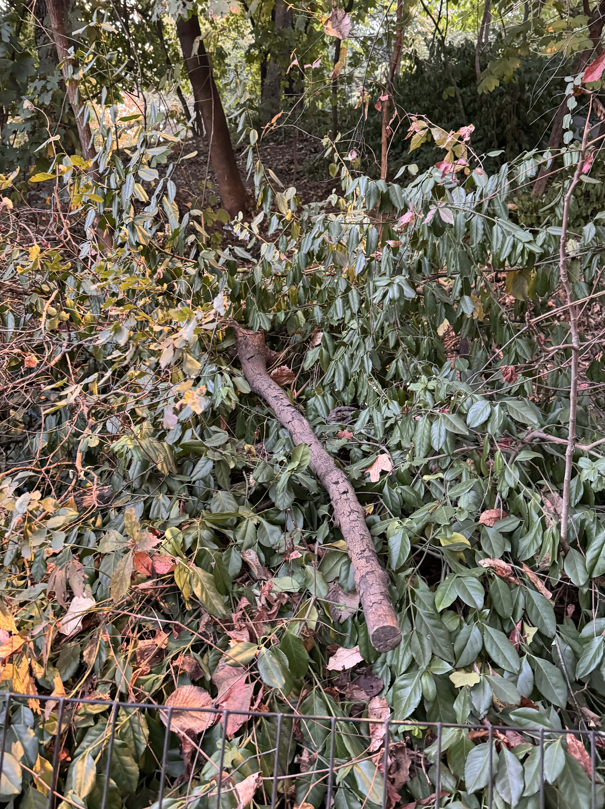

For my birthday, I hosted a stick gathering contest in Prospect Park, Brookyln.
I didn't know what the specifics for the game were, I just liked the idea of gathering sticks so I put it on the Partiful invitation description and sent it out.

## Game Description

I made up the rules for the game an hour before it started:

- create 2 teams with equal number people
- decide on 2 judges (myself and another person)
- I made up 5 categories for sticks
  - Walking stick
  - Magic stick
  - Decoration stick
  - Straight stick
  - Weapon stick
- teams had 20 minutes to explore prospect park and gather 1 stick for each category
- teams would return to the main site and judges would pick a winner team for each stick category
- the team with the most points would win the contest

Unfortunately I forgot to take pictures of the sticks, but I will recount them here (this was a few weeks ago so some memories have faded).

| Stick Category   | Team 1 Stick Description                             | Team 2 Stick Description                                                           | Winner |
| ---------------- | ---------------------------------------------------- | ---------------------------------------------------------------------------------- | ------ |
| Walking Stick    | a bit flimsy and thin                                | strong, stable walking stick                                                       | Team 2 |
| Magic Stick      | a small wand like harry potter                       | majestic large staff with a spiral at the top, reminscent of eul's scepter in dota | Team 2 |
| Decoration Stick | a big, heavy log large enough to sit on              | some sort of holiday-ornament like stick                                           | Team 1 |
| Straight Stick   | small straight stick, but extremely straight         | a larger straight stick, but with a slight bend                                    | Team 1 |
| Weapon Stick     | a stick shaped like a rifle, slightly dirty with ash | a majestic scythe-like weapon with the a blade end and a blunt end like a skull    | Team 2 |

Team 2 won overall with a score of 3-2. Congratulations Team 2! Good effort Team 1!

## Takeaway

This was a really fun event and I'm happy that my friends seemed to enjoy it. Some told me they were really looking forward to the stick gathering event when I put it on the schedule so I'm glad I didn't let them down.

I got a sense of nostalgia from this game, it felt like child-like play. Rules were made-up on the spot, people ran around the park picking up twigs and branches from the ground. It was unserious and fun.

I'm personally surprised I could remember details from each of the different sticks even weeks later. For context I've felt my memory begin to fade over the past year from the chaos of graduating college and moving to New York City. Amidst the jumbled memories of others' anecdotes and details, I can remember what each stick looked like and the passion of both teams' presenting them.

In the future, I want to do more activities like this: dynamic, unserious, fun.

|                          |
| --------------------------------------------- |
| the one picture of stick I remembered to take |
